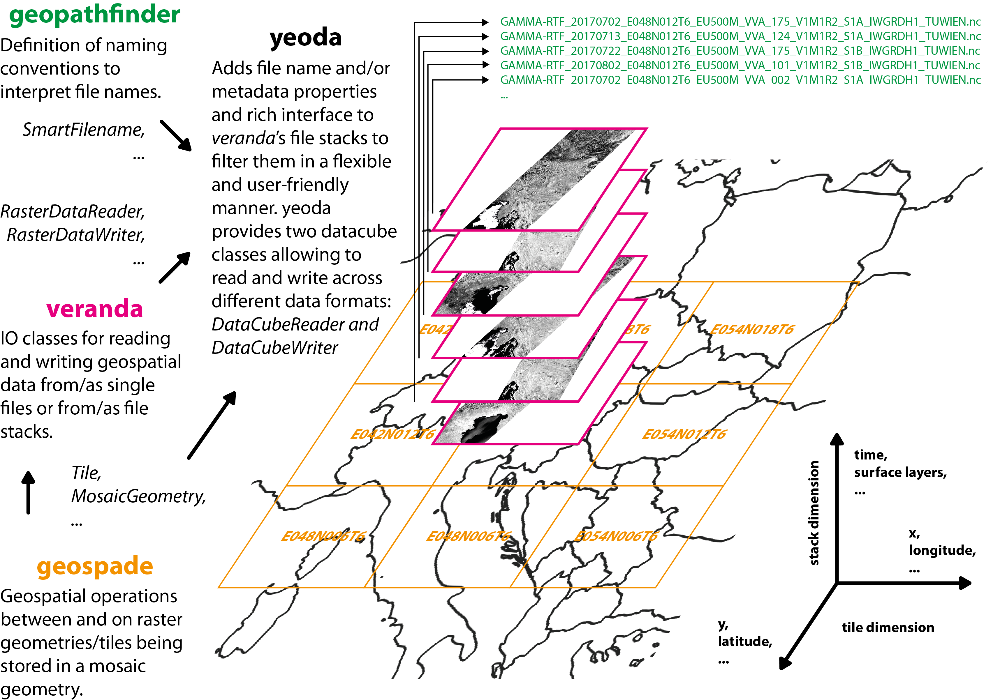

=====
yeoda
=====

*yeoda* stands for **y**\ our **e**\ arth **o**\ bservation **d**\ ata **a**\ ccess and is open source Python tool developed by the GEO Department at TU Wien. It provides transparent, flexible and user-friendly
access to work with well-defined and structured earth observation data, keeping a close relation with files on disk. It relies on several in-house developed Python packages wrapping around well-known standard libraries like *GDAL*, *netCDF4*, *xarray*, etc.
The overall picture how *yeoda* connects with these packages to access manifold geospatial datasets in a homogenous manner is shown below.

On the bottom, we have `geospade <https://github.com/TUW-GEO/geospade>`_ defining geometries, tiles, or mosaics and how they relate to each other. On top of *geospade*, `veranda <https://github.com/TUW-GEO/veranda>`_ unites these abstract geometries with I/O classes for dealing with all kinds of data formats. Finally, with the help `geopathfinder <https://github.com/TUW-GEO/geopathfinder>`_, *yeoda* allows to link data managed by *veranda*
with a file naming convention to interpret or build file names, from which file-based dimensions/coordinates are constructed.
With this modular setup, *yeoda* is able to accept either a data object (`xarray.Dataset`) or a list of files as input,
apply spatial sub-setting or filtering based on the pre-defined dimensions, and finally to read or write data from or to different formats. For example, you can read a stack of GeoTIFF files and write a single NetCDF file or vice versa.

*yeoda* offers two basic datacube classes, `DataCubeReader` and `DataCubeWriter`. Both inherit from `DataCube`, which consists of these essential parts:

- A file register represented by a data frame managing a stack/list of files containing the minimum set of columns:

  - "filepath": Full system paths to the files.
  - `stack_dimension` (defaults to "layer_id"): Specifies an ID to which layer a file belongs to, e.g. a layer counter or a timestamp.
  - `tile_dimension` (defaults to "tile_id"): Tile name or ID to which tile a file belongs to.

- A mosaic geometry `geospade.raster.MosaicGeometry` (or a child class) managing the spatial properties or representing the actual mosaic/grid of the files.
- The names of the tile (`tile_dimension`) and stack dimension (`stack_dimension`)

After initialising one of the datacube classes, you have access to a rich set of spatial selections, e.g. using a bounding box (`select_bbox()`) or polygon (`select_polygon()`), dimensional filters, e.g. filtering for file-based coordinates (`select_by_dimension`) or splitting a datacube in time (`split_by_temporal_freq()`), or datacube interactions, e.g. intersecting (`intersect()`) or uniting (`unite()`) two datacubes.
As soon as the data satisfies your data request, you can finally read (`read()`) data on disk to create an `xarray.Dataset` or write/export (`write()`/`export()`) in a file naming convention and data format of your choice.

Start playing around with *yeoda* by following the documentation and use case examples and feel free to contribute to the project via GitHub!

Contents
========

.. toctree::
   :maxdepth: 2

   General usage <notebooks/general_usage.ipynb>
   Examples <examples.rst>
   Installation <install>
   Module Reference <api/modules>
   License <license>
   Authors <authors>
   Changelog <changelog>

Indices and tables
==================

* :ref:`genindex`
* :ref:`modindex`
* :ref:`search`

.. _toctree: http://www.sphinx-doc.org/en/master/usage/restructuredtext/directives.html
.. _reStructuredText: http://www.sphinx-doc.org/en/master/usage/restructuredtext/basics.html
.. _references: http://www.sphinx-doc.org/en/stable/markup/inline.html
.. _Python domain syntax: http://sphinx-doc.org/domains.html#the-python-domain
.. _Sphinx: http://www.sphinx-doc.org/
.. _Python: http://docs.python.org/
.. _Numpy: http://docs.scipy.org/doc/numpy
.. _SciPy: http://docs.scipy.org/doc/scipy/reference/
.. _matplotlib: https://matplotlib.org/contents.html#
.. _Pandas: http://pandas.pydata.org/pandas-docs/stable
.. _Scikit-Learn: http://scikit-learn.org/stable
.. _autodoc: http://www.sphinx-doc.org/en/stable/ext/autodoc.html
.. _Google style: https://github.com/google/styleguide/blob/gh-pages/pyguide.md#38-comments-and-docstrings
.. _NumPy style: https://numpydoc.readthedocs.io/en/latest/format.html
.. _classical style: http://www.sphinx-doc.org/en/stable/domains.html#info-field-lists
